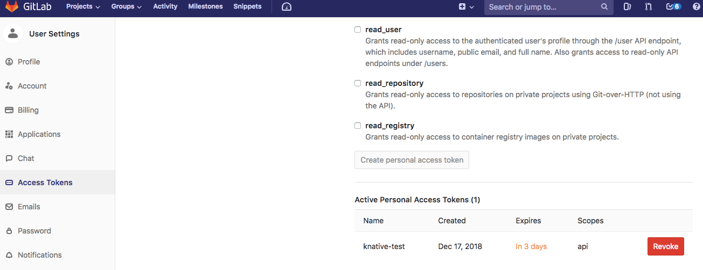

# GitLab Event Source for Knative

GitLab Source example shows how to wire GitLab events for consumption
by a Knative Service.

> **NOTE:** It is recommended that you clone this repository in order to apply the necessary files with custom values. You can optionally also create individual files for each step that requires it.

## Deploy the GitLab source controller

You will need to:

* Create a new API by creating a Custom Resource Definiton (CRD) object that defines `GitLabSource`
* Deploy the controller which watches `GitLabSource` objects and creates a GitLab webhook.

> **NOTE:** The Kubernetes `cluster-admin` role is required to perform these steps.

1. Create the new API definition:

    ```shell
    kubectl apply -f https://gitlab.com/triggermesh/gitlabsource/raw/master/config/crds/sources_v1alpha1_gitlabsource.yaml
    ```

2. Launch the controller and set all the required objects:

    ```shell
    wget -O release.yaml https://gitlab.com/triggermesh/gitlabsource/-/jobs/artifacts/master/raw/release.yaml?job=manifests
    kubectl apply -f release.yaml
    ```

    If the deployment goes well you should see the following output:

    ```
    namespace "gitlabsource-system" created
    clusterrole.rbac.authorization.k8s.io "gitlabsource-manager-role" created
    clusterrole.rbac.authorization.k8s.io "gitlabsource-proxy-role" created
    clusterrolebinding.rbac.authorization.k8s.io "gitlabsource-manager-rolebinding" created
    clusterrolebinding.rbac.authorization.k8s.io "gitlabsource-proxy-rolebinding" created
    secret "gitlabsource-webhook-server-secret" created
    service "gitlabsource-controller-manager-metrics-service" created
    service "gitlabsource-controller-manager-service" created
    statefulset.apps "gitlabsource-controller-manager" created
    ```

    At this point you have installed the GitLab Eventing source in your Knative cluster.

3. Check that the manager is running:

    ```shell
    kubectl get pods -n gitlabsource-system
    ```

    Output:

    ```shell
    NAME                                READY     STATUS    RESTARTS   AGE
    gitlabsource-controller-manager-0   2/2       Running   0          27s
    ```

    With the controller running you can now move on to a user persona and setup a GitLab webhook as well as a function that will consume GitLab events.

## Using the GitLab Event Source

You are now ready to use the Event Source and trigger functions based on GitLab projects events.

We will:

* Create a Knative service which will receive the events. To keep things simple this service will simply dump the events to `stdout`, this is the so-called: _message_dumper_
* Create a GitLab access token and a random secret token used to secure the webhooks.
* Create the event source by posting a GitLab source object manifest to Kubernetes

### Create a Knative Service

Create a simple Knative `service` that dumps incoming messages to its log. The `service` .yaml file
defines this basic service which will receive the configured GitLab event from the GitLabSource object. 
The contents of the `service` .yaml file are as follows:

```yaml
apiVersion: serving.knative.dev/v1alpha1
kind: Service
metadata:
  name: gitlab-message-dumper
spec:
  runLatest:
    configuration:
      revisionTemplate:
        spec:
          container:
            image: gcr.io/knative-releases/github.com/knative/eventing-sources/cmd/message_dumper
```

Enter the following command to create the service from `service.yaml`:

```shell
kubectl -n default apply -f https://gitlab.com/triggermesh/gitlabsource/raw/master/message-dumper.yaml
```

### Create GitLab Tokens

1. Create a [personal access token](https://docs.gitlab.com/ee/user/profile/personal_access_tokens.html)
which the GitLab source will use to register webhooks with the GitLab API. 
Also decide on a secret token that your code will use to authenticate the
incoming webhooks from GitLab ([_secretToken_](https://docs.gitlab.com/ee/user/project/integrations/webhooks.html#secret-token)).

    GitLab webhooks can be created and configured with the [Hook API](https://docs.gitlab.com/ee/api/projects.html#hooks)

    Here's an example for a token named "knative-test" with the
    recommended scopes:

    

2. Create a file called `gitlabsecret.yaml` with the following values:

    ```yaml
    apiVersion: v1
    kind: Secret
    metadata:
      name: gitlabsecret
    type: Opaque
    stringData:
      accessToken: personal_access_token_value
      secretToken: asdfasfdsaf
    ```

    Where `accessToken` is the personal access token created in step 1. and `secretToken` (`asdfasdfas` above) is any token of your choosing.
    
    Hint: you can generate a random _secretToken_ with:

    ```shell
    head -c 8 /dev/urandom | base64
    ```

3. Apply the gitlabsecret using `kubectl`.

    ```shell
    kubectl --n default apply -f gitlabsecret.yaml
    ```

### Create Event Source for GitLab Events

1. In order to receive GitLab events, you have to create a concrete Event
Source for a specific namespace. Replace the `projectUrl` value in the file `gitlabeventbinding.yaml`
  with your GitLab username and project name. For example, if your repo URL is 
  `https://gitlab.com/knative-examples/functions` then use it as the value for `projectUrl`.

    ```yaml
    apiVersion: sources.eventing.triggermesh.dev/v1alpha1
    kind: GitLabSource
    metadata:
      name: gitlabsample
    spec:
      eventTypes:
        - merge_requests_events
        - push_events
        - issues_events
      projectUrl: https://<GITLAB_URL>/<USERSPACE>/<PROJECT NAME>
      accessToken:
        secretKeyRef:
          name: gitlabsecret
          key: accessToken
      secretToken:
        secretKeyRef:
          name: gitlabsecret
          key: secretToken
      sink:
        apiVersion: serving.knative.dev/v1alpha1
        kind: Service
        name: gitlab-message-dumper
    ```

2. Apply the yaml file using `kubectl`:

    2.1. If you cloned this repository use your specific URL where `userspace` below points to your repository:

    ```shell
    kubectl -n default apply -f https://gitlab.com/<userspace>/gitlabsource/raw/master/gitlabeventbinding.yaml
    ```

    2.2. If you rather not clone the repo, create a file called `gitlabeventbinding.yaml` with the contents above and apply it:

    ```shell
    kubectl -n default apply -f gitlabeventbinding.yaml
    ```

### Verify

Verify the GitLab webhook was created by looking at the list of
webhooks under **Settings >> Integrations** in your GitLab project. A hook
should be listed that points to your Knative cluster.

Create a push event and check the logs of the Pod backing the `message-dumper`. You will see the GitLab event.

